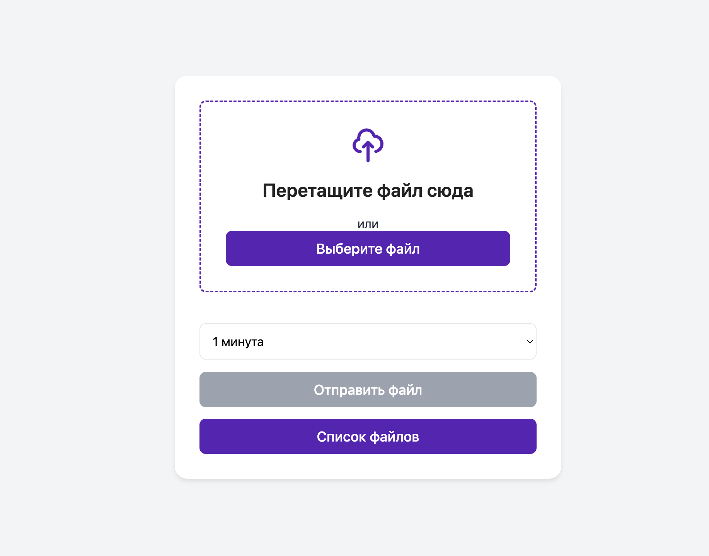
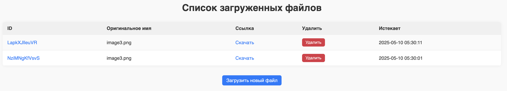
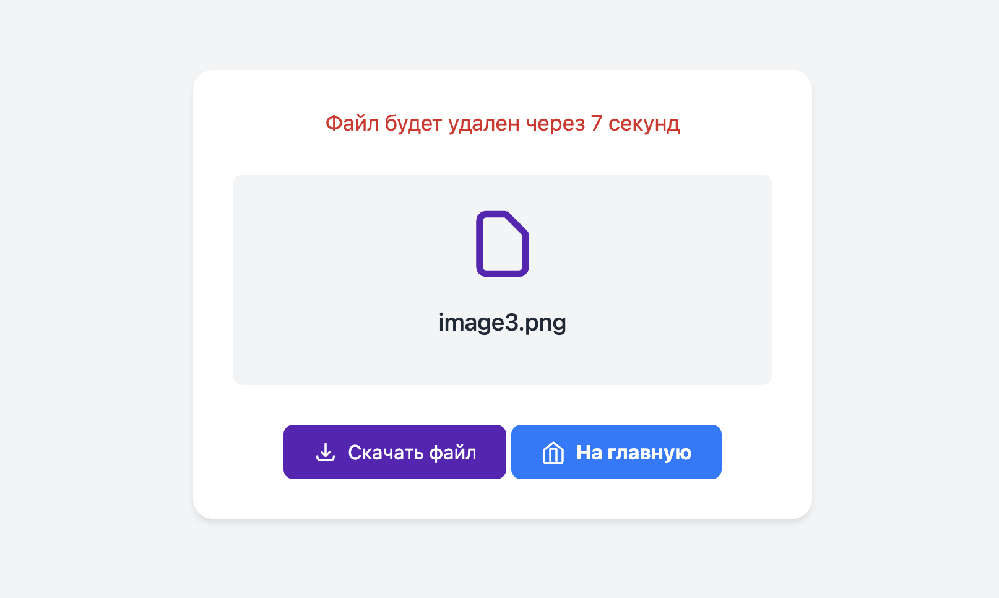

# FastAPI File Uploader with Redis & Celery

Этот проект представляет собой простой сервис загрузки файлов с возможностью их автоматического удаления по истечении заданного времени. В основе лежат **FastAPI**, **Celery**, **Redis**, и **Python 3.13+**.

---


## 📦 Возможности

- Загрузка файлов через HTML-форму или API.
- Сохранение метаданных файла в Redis.
- Автоматическое удаление файла через заданное количество минут (фоновая задача Celery).
- HTML-интерфейс для просмотра загруженных файлов.
- Возможность скачать или удалить файл вручную.

---

## ⚙️ Установка и запуск

### 📦 Переменные окружения (.env)
```bash
BASE_URL=http://backend:8000
BROKER_URL=redis://redis:6379/0
```

⚠️ **Внимание:** localhost в BASE_URL работает только при запуске сервера и Celery на одной машине без Docker.


### 🐳 Использование с Docker
```bash
docker-compose up --build
```
### Загрузка файлов


### Спискок файлов


### Контроль файла

